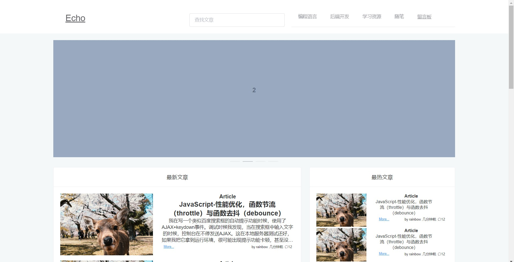
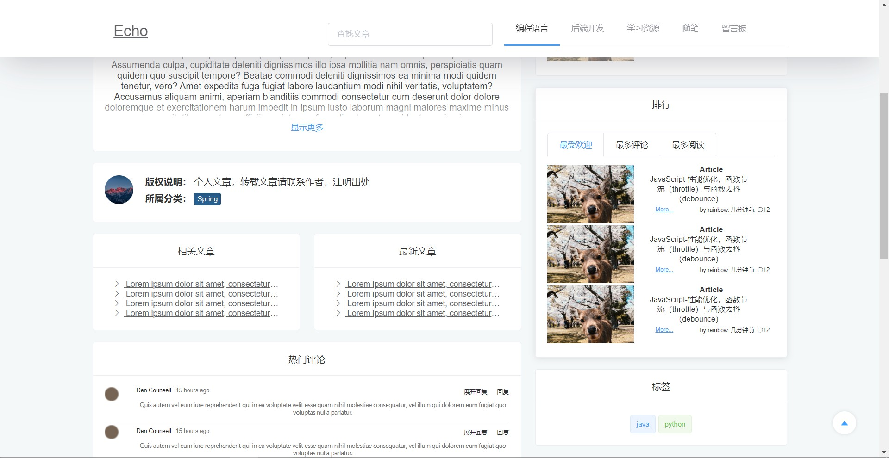
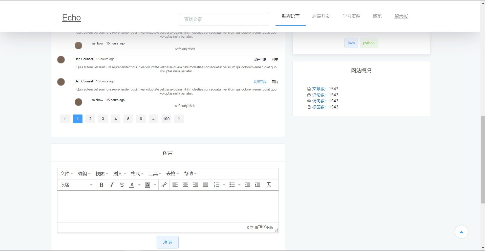
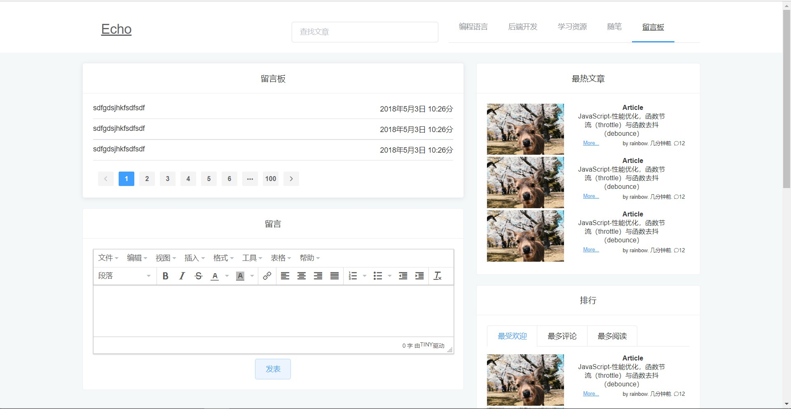
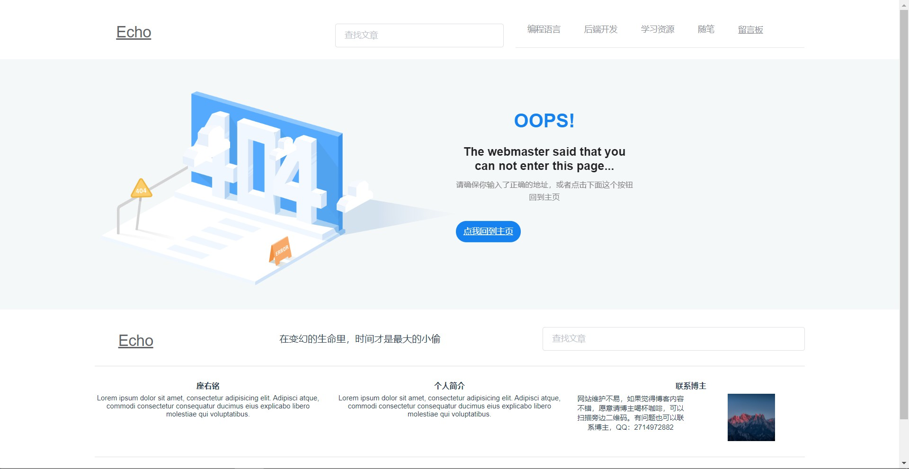

# vue-element-blog
基于Vue，使用了ElementUI，Vue router进行开发的前端项目。可用于个人博客项目的二次开发，因为以前完善了许多样式效果，可以很简单的进行使用。

# Build Setup

``` bash
# install dependencies
npm install

# serve with hot reload at localhost:8080
npm run dev

# build for production with minification
npm run build

# build for production and view the bundle analyzer report
npm run build --report

# run unit tests
npm run unit

# run e2e tests
npm run e2e

# run all tests
npm test
```

# 效果
GitHub上如果没有效果，可以前往码云查看：https://gitee.com/rainbowecho/vue-element-blog
首页


文章详情页面



留言板页面


404 页面


# 其他
如果觉得不错，请点个star。欢迎fork和pull。
